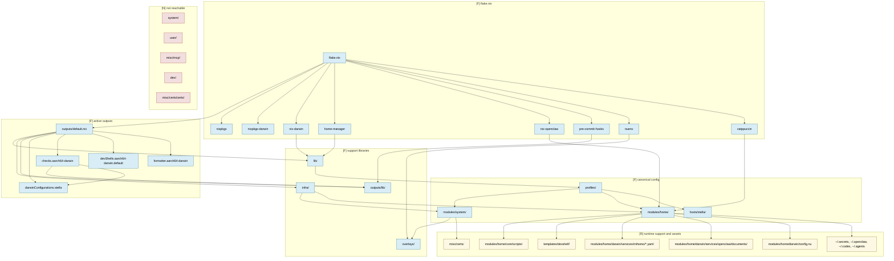

# Nix Infrastructure Graph Report

## 1. Concise Summary

This repository’s active flake path is narrow and fairly clear: [`flake.nix`](../flake.nix) delegates all outputs to [`outputs/`](../outputs), which assembles shared helpers from [`lib/`](../lib), host/user variables from [`infra/`](../infra), and one active Darwin host through [`profiles/`](../profiles) plus [`hosts/stella/`](../hosts/stella). The canonical configuration lives under [`modules/`](../modules), with system policy in `modules/system/*` and Home Manager policy in `modules/home/*`.

The strongest architectural boundary is:

`infra -> modules -> profiles -> hosts`

The most important caveat is that several directories are intentionally outside the module import graph but still matter at runtime. In particular, [`templates/devshell/`](../templates/devshell), [`modules/home/core/scripts/`](../modules/home/core/scripts), [`modules/home/darwin/services/openclaw/documents/`](../modules/home/darwin/services/openclaw/documents), [`modules/home/darwin/config.nu`](../modules/home/darwin/config.nu), and the Mihomo YAML files are runtime assets rather than imported Nix modules.

The most fragile areas are:

- proxy ownership spread across `infra/networking/*`, `modules/system/darwin/system/proxy-tools.nix`, `modules/home/darwin/shell.nix`, and Mihomo runtime config
- OpenClaw runtime activation doing imperative plugin installs, symlink/copy work, and local filesystem mirroring
- an absolute path to the old tree in [`infra/networking/mihomo.nix`](../infra/networking/mihomo.nix)
- legacy path names (`system/`, `user/`) still present in comments and docs after the move to `modules/`

### Reachability Legend

- `[F]` flake-reachable: part of the active flake/evaluation/build graph
- `[R]` runtime-reachable only: intentionally outside the main module import graph, but used by installed helpers, generated config, or running services
- `[N]` not reachable: no active flake/runtime path found

## 2. ASCII Graph

```text
[F] flake.nix
├─ inputs
│  ├─ [F] nixpkgs ------------------------------┐
│  ├─ [F] nixpkgs-darwin -> nix-darwin ---------┤
│  ├─ [F] home-manager -------------------------┤
│  ├─ [F] nix-openclaw -------------------------┤
│  ├─ [F] pre-commit-hooks ---------------------┤
│  ├─ [F] nuenv -------------------------------┐│
│  └─ [F] catppuccin -------------------------┐││
│                                             │││
└─ [F] outputs/default.nix -------------------┘││
   ├─ [F] lib/default.nix ----------------------┘│
   │  ├─ [F] lib/macosSystem.nix <--- nix-darwin, home-manager
   │  ├─ [F] lib/module-discovery.nix
   │  └─ [F] lib/path-resolve.nix
   ├─ [F] infra/default.nix ---------------------┘
   │  ├─ [F] infra/identity.nix
   │  ├─ [F] infra/toolchains.nix
   │  └─ [F] infra/networking/default.nix
   │     ├─ [F] proxy.nix
   │     ├─ [F] mihomo.nix
   │     ├─ [F] dns.nix
   │     ├─ [F] hosts.nix
   │     └─ [F] ssh.nix
   ├─ [F] outputs/lib/smoke-check.nix
   ├─ [F] outputs/lib/pre-commit-hooks.nix <--- pre-commit-hooks input
   └─ [F] outputs/darwin/default.nix
      ├─ [F] darwinConfigurations.stella
      │  ├─ [F] profiles/system/stella.nix
      │  │  ├─ [F] modules/system/common.nix
      │  │  │  ├─ [F] fonts.nix
      │  │  │  ├─ [F] nix.nix
      │  │  │  ├─ [F] nixpkgs.nix
      │  │  │  ├─ [F] overlays.nix -> [F] overlays/default.nix -> nuenv overlay
      │  │  │  ├─ [F] security.nix -> [R] misc/certs/ecc-ca.crt
      │  │  │  ├─ [F] system-packages.nix
      │  │  │  └─ [F] users.nix
      │  │  ├─ [F] modules/system/darwin/default.nix
      │  │  │  ├─ [F] apps.nix
      │  │  │  ├─ [F] nix-determinate.nix
      │  │  │  ├─ [F] security.nix
      │  │  │  ├─ [F] users.nix
      │  │  │  ├─ [F] system.nix
      │  │  │  │  ├─ [F] activation.nix
      │  │  │  │  ├─ [F] defaults-ui.nix
      │  │  │  │  ├─ [F] input.nix
      │  │  │  │  ├─ [F] proxy-tools.nix  ---> runtime command surface
      │  │  │  │  ├─ [F] security-pam.nix
      │  │  │  │  └─ [F] timezone.nix
      │  │  │  └─ [F] maintenance/default.nix -> [F] nix-store.nix
      │  │  └─ [F] hosts/stella/system.nix
      │  └─ [F] profiles/user/stella.nix
      │     ├─ [F] modules/home/base.nix
      │     ├─ [F] modules/home/core/default.nix
      │     │  ├─ [F] packages.nix
      │     │  │  ├─ [R] modules/home/core/scripts/devshell-init
      │     │  │  ├─ [R] modules/home/core/scripts/devshell-attach
      │     │  │  └─ [R] templates/devshell/*
      │     │  ├─ [F] tooling/toolchain.nix -> infra/toolchains.nix
      │     │  ├─ [F] tooling/infra.nix
      │     │  ├─ [F] git.nix
      │     │  ├─ [F] cli-experience.nix
      │     │  ├─ [F] neovim.nix
      │     │  ├─ [F] pip.nix
      │     │  ├─ [F] starship.nix
      │     │  └─ [F] theme.nix <--- catppuccin input
      │     ├─ [F] modules/home/darwin/default.nix
      │     │  ├─ [F] apps/ghostty.nix
      │     │  ├─ [F] shell.nix -> [R] config.nu
      │     │  └─ [F] services/default.nix
      │     │     ├─ [F] mihomo/default.nix
      │     │     │  └─ [R] config.local.yaml | config.yaml | config.yaml.example
      │     │     └─ [F] openclaw/default.nix <--- nix-openclaw input
      │     │        ├─ [F] package.nix
      │     │        ├─ [F] plugins.nix
      │     │        ├─ [F] config.nix
      │     │        ├─ [F] secrets.nix -> ~/.secrets/*
      │     │        └─ [F] runtime.nix
      │     │           ├─ [R] openclaw/documents/*
      │     │           ├─ [R] ~/.codex -> ~/.agents skills mirror
      │     │           ├─ [R] ~/.openclaw/extensions/*
      │     │           └─ [R] local PATH managers / npm cache / launchd state
      │     └─ [F] hosts/stella/home.nix
      └─ [F] outputs/darwin/tests/default.nix -> smoke-eval check

[N] system/        (legacy top-level namespace, now empty)
[N] user/          (legacy namespace kept only as docs)
[N] misc/mcp/      (no active references found)
[N] dev/           (empty placeholder)
[N] misc/certs/certs/ (duplicate cert subtree, no active references found)
```

## 3. Mermaid Graph



## 4. Dependency Table

| Path | Reachability | Classification | Depends on / Feeds | Notes |
| --- | --- | --- | --- | --- |
| `flake.nix` | `[F]` | canonical config | feeds `outputs/`, declares all flake inputs | single root |
| `outputs/` | `[F]` | canonical config | feeds active outputs | all exported outputs originate here |
| `outputs/darwin/` | `[F]` | canonical config | feeds `darwinConfigurations.stella`, eval tests | single active host |
| `outputs/darwin/tests/` | `[F]` | canonical config | feeds `checks.aarch64-darwin.smoke-eval` | test layer only verifies eval invariants |
| `outputs/lib/` | `[F]` | canonical config | feeds `smoke-eval` and `pre-commit` checks | `pre-commit` config is lazily used |
| `lib/` | `[F]` | canonical config | consumed by `outputs/` and modules | owns `macosSystem`, path helpers, import discovery |
| `infra/` | `[F]` | canonical config | feeds modules via `myvars` | identity, toolchains, networking policy |
| `infra/networking/` | `[F]` | canonical config | feeds proxy/mihomo/dns/ssh policy | contains hidden absolute path in `mihomo.nix` |
| `profiles/` | `[F]` | canonical config | composes canonical modules into host/user stacks | current assembly layer |
| `profiles/system/` | `[F]` | canonical config | imports `modules/system/*` and `hosts/stella/system.nix` | one system profile |
| `profiles/user/` | `[F]` | canonical config | imports `modules/home/*` and `hosts/stella/home.nix` | one user profile |
| `hosts/` | `[F]` | canonical config | host-specific overrides only | correct placement for machine diffs |
| `hosts/stella/` | `[F]` | canonical config | feeds profile composition | very small, good boundary |
| `modules/` | `[F]` | canonical config | canonical system and HM module tree | primary source of persistent state |
| `modules/system/` | `[F]` | canonical config | system-level nix-darwin modules | common + Darwin split |
| `modules/system/common/` | `[F]` | canonical config | general system policy | includes Nix, fonts, overlays, users, packages |
| `modules/system/darwin/` | `[F]` | canonical config | Darwin-specific system policy | apps, security, users, maintenance, system behavior |
| `modules/system/darwin/system/` | `[F]` | canonical config | feeds activation/defaults/proxy tools | proxy tooling is the imperative boundary |
| `modules/home/` | `[F]` | canonical config | Home Manager module tree | split into base/core/darwin |
| `modules/home/core/` | `[F]` | canonical config | feeds user tools/theme/CLI | depends on `infra/toolchains.nix` and `catppuccin` |
| `modules/home/core/scripts/` | `[R]` | runtime support | installed by `modules/home/core/packages.nix` | helper scripts are not modules; they are shipped executables |
| `modules/home/darwin/` | `[F]` | canonical config | Darwin HM modules | shell, apps, services |
| `modules/home/darwin/config.nu` | `[R]` | runtime support | linked by `modules/home/darwin/shell.nix` | runtime shell asset |
| `modules/home/darwin/services/mihomo/` | `[R]` | runtime support | configured by HM service module | Nix module plus YAML/runtime config payload |
| `modules/home/darwin/services/openclaw/` | `[F]` | runtime support | fed by `nix-openclaw`, local runtime/activation logic | active service boundary with heavy runtime behavior |
| `modules/home/darwin/services/openclaw/documents/` | `[R]` | runtime support | passed to `programs.openclaw.documents` | documentation payload for deployed OpenClaw workspace |
| `overlays/` | `[F]` | canonical config | loaded from `modules/system/common/overlays.nix` | currently minimal, but auto-discovers `.nix` files |
| `templates/` | `[R]` | template assets | copied by `devshellTools` derivation | intentionally outside module import graph |
| `templates/devshell/` | `[R]` | template assets | consumed by `devshell-init` / `devshell-attach` | active runtime payload, not imported as modules |
| `misc/` | `[R]` | runtime support | mixed asset area | only `misc/certs/` is actively referenced |
| `misc/certs/` | `[R]` | runtime support | cert asset for `modules/system/common/security.nix` | committed public certs + imperative generation script |
| `misc/certs/certs/` | `[N]` | likely stale | no active references found | appears to duplicate top-level cert artifacts |
| `misc/mcp/` | `[N]` | likely stale | no active references found | placeholder/non-integrated support area |
| `system/` | `[N]` | likely stale | no active code references | legacy namespace after move to `modules/system/` |
| `user/` | `[N]` | compatibility layer | docs/comments still point here | old namespace retained only in docs/mental model |
| `dev/` | `[N]` | likely stale | empty | placeholder directory |

### Flake Dependency Map

| Source | Target | Status | Why it matters |
| --- | --- | --- | --- |
| `flake.nix` | `outputs/default.nix` | active | root local output delegate |
| `flake.nix` | `nixpkgs` | active | base `lib` and package set for dev shell, checks, HM modules |
| `flake.nix` | `nixpkgs-darwin -> nix-darwin` | active | system assembly backend |
| `flake.nix` | `home-manager` | active | user module integration in `lib/macosSystem.nix` |
| `flake.nix` | `nix-openclaw` | active | OpenClaw HM module and package source |
| `flake.nix` | `pre-commit-hooks` | active | `checks.aarch64-darwin.pre-commit` |
| `flake.nix` | `nuenv` | active | injected into `nixpkgs.overlays` |
| `flake.nix` | `catppuccin` | active | theme module import in `modules/home/core/theme.nix` |
| `outputs/default.nix` | `lib/default.nix` | active | helper exports |
| `outputs/default.nix` | `infra/default.nix` | active | `myvars` for system/home modules |
| `outputs/default.nix` | `outputs/lib/smoke-check.nix` | active | smoke check derivation |
| `outputs/default.nix` | `outputs/lib/pre-commit-hooks.nix` | active | pre-commit check configuration |
| `outputs/default.nix` | `outputs/darwin/default.nix` | active | only host assembly entry |
| `outputs/darwin/default.nix` | `profiles/system/stella.nix` | active | system profile root |
| `outputs/darwin/default.nix` | `profiles/user/stella.nix` | active | home profile root |
| `outputs/darwin/default.nix` | `outputs/darwin/tests/default.nix` | active | evaluation assertions |
| `profiles/system/stella.nix` | `modules/system/common.nix` | active | shared system policy |
| `profiles/system/stella.nix` | `modules/system/darwin/default.nix` | active | Darwin system policy |
| `profiles/system/stella.nix` | `hosts/stella/system.nix` | active | host identity override |
| `profiles/user/stella.nix` | `modules/home/base.nix` | active | home bootstrap |
| `profiles/user/stella.nix` | `modules/home/core/default.nix` | active | common user tooling |
| `profiles/user/stella.nix` | `modules/home/darwin/default.nix` | active | Darwin HM policy |
| `profiles/user/stella.nix` | `hosts/stella/home.nix` | active | host-specific user override |

## 5. Recommendations

### Architectural Concerns

1. **Duplicate ownership around proxy behavior**
   - Proxy defaults and environment shape live in [`infra/networking/proxy.nix`](../infra/networking/proxy.nix).
   - Mihomo runtime facts live in [`infra/networking/mihomo.nix`](../infra/networking/mihomo.nix).
   - System proxy mutation lives in [`modules/system/darwin/system/proxy-tools.nix`](../modules/system/darwin/system/proxy-tools.nix).
   - Shell proxy export behavior lives in [`modules/home/darwin/shell.nix`](../modules/home/darwin/shell.nix).
   - This split is coherent enough to work, but ownership is not obvious and changes can ripple across both system and user layers.

2. **Hidden dependencies from directory scanning and path precedence**
   - [`lib/module-discovery.nix`](../lib/module-discovery.nix) can import by directory contents, not only explicit lists.
   - [`overlays/default.nix`](../overlays/default.nix) auto-loads all overlay `.nix` files in that directory.
   - [`modules/home/darwin/services/mihomo/default.nix`](../modules/home/darwin/services/mihomo/default.nix) chooses `config.local.yaml`, then `config.yaml`, then `config.yaml.example`.
   - These are intentional, but they make the graph less explicit than the profile/module layout suggests.

3. **Non-obvious runtime coupling**
   - [`modules/home/core/packages.nix`](../modules/home/core/packages.nix) copies all of [`templates/devshell/`](../templates/devshell) into a helper package; those template flakes are outside the module graph but still shipped.
   - [`modules/home/darwin/services/openclaw/runtime.nix`](../modules/home/darwin/services/openclaw/runtime.nix) mirrors `~/.codex` skills into `~/.agents`, installs plugins into `~/.openclaw/extensions`, and depends on secrets in `~/.secrets`.
   - [`modules/home/darwin/services/openclaw/package.nix`](../modules/home/darwin/services/openclaw/package.nix) patches upstream package internals and launchd labels.
   - These couplings are powerful, but not obvious from the top-level flake alone.

4. **Imperative glue inside an otherwise declarative repo**
   - `proxy-on`, `proxy-off`, `proxy-status`, `proxy-env-*` mutate macOS/network runtime state via `networksetup`.
   - OpenClaw uses Home Manager activation hooks with `rm`, `cp`, `ln`, and `npm install --omit=dev --ignore-scripts`.
   - [`modules/home/core/git.nix`](../modules/home/core/git.nix) removes `~/.gitconfig` before activation.
   - [`misc/certs/gen-certs.sh`](../misc/certs/gen-certs.sh) is an imperative certificate-generation workflow beside the declarative Nix graph.

5. **Upgrade fragility**
   - [`infra/networking/mihomo.nix`](../infra/networking/mihomo.nix) hardcodes `/Users/sue/Code/nix/user/darwin/services/mihomo/.runtime`, which points into the old namespace and a specific checkout location.
   - OpenClaw package patching depends on upstream file layout and text constants remaining stable.
   - The repo still contains doc/comment references to `system/*` and `user/*`, while canonical code moved to `modules/*`.
   - `src = ../../..` in the devshell helper derivation widens coupling to the whole repository, so unrelated tree changes can affect helper packaging.

### Recommended Next Moves

1. Replace the absolute Mihomo mirror path in [`infra/networking/mihomo.nix`](../infra/networking/mihomo.nix) with a canonical path rooted in the active module tree or Home Manager state path.
2. Decide whether `user/` and `system/` should remain as explicit compatibility/docs namespaces or be removed entirely; right now they mostly increase cognitive load.
3. Make runtime-only edges more explicit in docs:
   - `templates/devshell/`
   - `modules/home/core/scripts/`
   - `modules/home/darwin/config.nu`
   - `modules/home/darwin/services/openclaw/documents/`
   - Mihomo YAML assets
4. Consider reducing imperative OpenClaw activation work by moving more plugin/runtime assembly into build-time derivations where practical.
5. Split `misc/` into:
   - actively referenced runtime assets (`misc/certs/`)
   - archived or scratch areas (`misc/mcp/`, duplicate `misc/certs/certs/`)
6. Keep the layered architecture explicit in future changes:
   - `infra` defines facts and policy inputs
   - `modules` owns reusable declarative behavior
   - `profiles` performs composition
   - `hosts` contains only machine-specific deltas

### Explicitly Outside the Flake Evaluation Graph but Still Used

- [`templates/devshell/`](../templates/devshell): copied into the `devshellTools` package and used by `devshell-init` / `devshell-attach`
- [`modules/home/core/scripts/`](../modules/home/core/scripts): installed runtime helper scripts, not Nix modules
- [`modules/home/darwin/config.nu`](../modules/home/darwin/config.nu): linked as Nushell config by Home Manager
- [`modules/home/darwin/services/openclaw/documents/`](../modules/home/darwin/services/openclaw/documents): passed as runtime documents bundle to OpenClaw
- Mihomo YAML files under [`modules/home/darwin/services/mihomo/`](../modules/home/darwin/services/mihomo): selected by path precedence and linked into `~/.config/mihomo/config.yaml`
